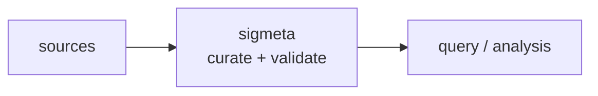

<a name="top"></a>

<div align="center">


# SIGMETA


### Parse and classify signal metadata (freq, modulation, bandwidth) into a normalized catalog.


[](https://pypi.org/project/cognis-sigmeta/) [](https://github.com/cognis-digital/sigmeta/actions) [](LICENSE) [](https://github.com/cognis-digital)


*Part of the Cognis Neural Suite.*


</div>


```bash

pip install cognis-sigmeta

sigmeta classify capture.log         # → normalized signal catalog in ms

```


<!-- cognis:example:start -->
## 🔎 Example output

Real, reproducible output from the tool — runs offline:

```console
$ sigmeta-emit --version
sigmeta 0.6.6
```

```console
$ sigmeta-emit --help
usage: sigmeta [-h] [--version] [--format {table,json,csv}] {classify} ...

Parse and classify signal metadata into a normalized catalog.

positional arguments:
  {classify}
    classify            parse a signal log into a normalized catalog

options:
  -h, --help            show this help message and exit
  --version             show program's version number and exit
  --format {table,json,csv}
                        output format (default: table)
```

> Blocks above are real `sigmeta` output — reproduce them from a clone.

**Sample result format** _(illustrative values — run on your own data for real findings):_

```
{
"findings": [
    {
        "id": "1234567890",
        "title": "Suspicious Network Traffic",
        "description": "Anomalous network traffic detected from IP 192.168.1.100",
        "created_by": "John Doe",
        "created_at": "2023-02-15T14:30:00Z"
    },
    {
        "id": "2345678901",
        "title": "Malware Detection",
        "description": "Malware detected on machine with IP 192.168.1.101",
        "created_by": "Jane Smith",
        "created_at": "2023-02-16T10:45:00Z"
    }
]
}
```

<!-- cognis:example:end -->

## Contents


- [Why sigmeta?](#why) · [Features](#features) · [Quick start](#quick-start) · [Example](#example) · [Architecture](#architecture) · [AI stack](#ai-stack) · [How it compares](#how-it-compares) · [Integrations](#integrations) · [Install anywhere](#install-anywhere) · [Related](#related) · [Contributing](#contributing)


## Usage — step by step

`sigmeta` parses textual signal-metadata logs into a normalized catalog (frequency, band, modulation, bandwidth, service hint). Analysis-only — no transmit or hardware control. Exits `1` when no records parse.

1. **Install**
   ```bash
   pip install sigmeta
   ```

2. **Classify a log file** into a catalog table:
   ```bash
   sigmeta classify capture.log
   ```

3. **Pipe from stdin** (the input arg defaults to `-`):
   ```bash
   cat capture.log | sigmeta classify -
   ```

4. **Read JSON output** for downstream processing, **CSV** for spreadsheets/SIEM, or just the rollup with `--summary-only`:
   ```bash
   sigmeta --format json classify capture.log | jq '.summary'
   sigmeta --format csv  classify capture.log > catalog.csv
   sigmeta classify capture.log --summary-only
   ```

5. **Gate automation/CI** — use `--strict` to fail on the first unparseable line, and rely on the non-zero exit when nothing parses:
   ```bash
   sigmeta classify capture.log --strict || echo "no usable signal records"
   ```

<a name="why"></a>

## Why sigmeta?


Parse and classify signal metadata (freq, modulation, bandwidth) into a normalized catalog. — without standing up heavyweight infrastructure.


`sigmeta` is single-purpose, scriptable, and self-hostable: point it at a log, get a normalized catalog in the format your workflow already speaks (table · JSON · CSV), gate CI on the exit code, and let agents drive it over MCP.


<div align="right"><a href="#top">↑ back to top</a></div>


<a name="features"></a>

## Features


- ✅ Normalize Modulation

- ✅ Classify Band

- ✅ Service Hint

- ✅ Parse Line

- ✅ Parse Lines

- ✅ Catalog Summary

- ✅ Table · JSON · CSV output (`--format csv` for spreadsheets/SIEM)

- ✅ Runs on Linux/macOS/Windows · Docker · devcontainer

- ✅ Ports in Python, JavaScript, Go, and Rust (`ports/`)


<div align="right"><a href="#top">↑ back to top</a></div>


<a name="quick-start"></a>

## Quick start


```bash

pip install cognis-sigmeta

sigmeta --version

sigmeta classify capture.log                 # normalized catalog (table)

sigmeta --format json classify capture.log   # machine-readable

sigmeta --format csv  classify capture.log   # spreadsheet / SIEM import

cat capture.log | sigmeta classify -         # stdin

sigmeta classify capture.log --strict        # CI gate (non-zero exit)

```


<div align="right"><a href="#top">↑ back to top</a></div>


<a name="example"></a>

## Example


```text

$ sigmeta classify demos/02-airband-scan/airband.log

LABEL      FREQ        BAND  MOD  BW        SERVICE HINT
---------  ----------  ----  ---  --------  -----------------------------
TWR        118.3 MHz   VHF   AM   8.33 kHz  Aeronautical (AM voice / nav)
GND        121.9 MHz   VHF   AM   25 kHz    Aeronautical (AM voice / nav)
EMERGENCY  121.5 MHz   VHF   AM   25 kHz    Aeronautical (AM voice / nav)

records=6  bands={'VHF': 6}  mods={'AM': 6}  warnings=0

```

### Try the demos

`demos/` ships realistic, ready-to-run signal logs in the tool's real input
format, each with a `SCENARIO.md` (where the data came from, the exact run
command, and what to expect):

| Demo | Scenario |
|---|---|
| `01-basic` | Heterogeneous mixed-style log (kv + positional, mixed units) |
| `02-airband-scan` | VHF aeronautical airband (118-137 MHz AM) |
| `03-ism-survey` | ISM / U-NII unlicensed-band spectrum survey |
| `04-hf-utility` | HF utility / shortwave monitoring (3-30 MHz) |
| `05-empty-strict` | No usable records → exit-code / CI gate |
| `06-marine-vhf` | Marine VHF channel plan (156-162 MHz) |
| `07-pmr-landmobile` | UHF land-mobile / FRS-GMRS / DMR inventory |
| `08-satellite-downlink` | Satellite / weather downlink tracking |
| `09-mixed-units-csv` | Every unit/style → `--format csv` export |

```bash
python -m sigmeta classify demos/03-ism-survey/ism.log
python -m sigmeta --format csv classify demos/09-mixed-units-csv/capture.log
```


<div align="right"><a href="#top">↑ back to top</a></div>


<a name="architecture"></a>

## Architecture





<div align="right"><a href="#top">↑ back to top</a></div>


<a name="ai-stack"></a>

## Use it from any AI stack


`sigmeta` is interoperable with every popular way of using AI:


- **MCP server** — `sigmeta mcp` (Claude Desktop, Cursor, Cognis.Studio, [uncensored-fleet](https://github.com/cognis-digital/uncensored-fleet))

- **OpenAI-compatible / JSON** — pipe `sigmeta --format json classify capture.log` into any agent or LLM

- **LangChain · CrewAI · AutoGen · LlamaIndex** — wrap the CLI/JSON as a tool in one line

- **CI / scripts** — exit codes + CSV/JSON for non-AI pipelines


<div align="right"><a href="#top">↑ back to top</a></div>


<a name="how-it-compares"></a>

## How it compares


| | **Cognis sigmeta** | typical tools |

|---|:---:|:---:|

| Self-hostable, no account | ✅ | varies |

| Single command, zero config | ✅ | ⚠️ |

| JSON + CSV for CI | ✅ | varies |

| MCP-native (AI agents) | ✅ | ❌ |

| Polyglot ports (JS/Go/Rust) | ✅ | ❌ |

| Open license | ✅ COCL | varies |

<div align="right"><a href="#top">↑ back to top</a></div>


<a name="integrations"></a>

## Integrations


Pipes into your stack: **CSV** for spreadsheets/SIEM, **JSON** for anything, an **MCP server** (`sigmeta mcp`) for AI agents, and a webhook forwarder for SIEM/Slack/Jira. See [`docs/INTEGRATIONS.md`](docs/INTEGRATIONS.md).


<div align="right"><a href="#top">↑ back to top</a></div>


<a name="install-anywhere"></a>

## Install — every way, every platform


```bash

pip install "git+https://github.com/cognis-digital/sigmeta.git"    # pip (works today)

pipx install "git+https://github.com/cognis-digital/sigmeta.git"   # isolated CLI

uv tool install "git+https://github.com/cognis-digital/sigmeta.git" # uv

pip install cognis-sigmeta                                          # PyPI (when published)

docker run --rm ghcr.io/cognis-digital/sigmeta:latest --help        # Docker

brew install cognis-digital/tap/sigmeta                             # Homebrew tap

curl -fsSL https://raw.githubusercontent.com/cognis-digital/sigmeta/main/install.sh | sh

```


| Linux | macOS | Windows | Docker | Cloud |

|---|---|---|---|---|

| `scripts/setup-linux.sh` | `scripts/setup-macos.sh` | `scripts/setup-windows.ps1` | `docker run ghcr.io/cognis-digital/sigmeta` | [DEPLOY.md](docs/DEPLOY.md) (AWS/Azure/GCP/k8s) |


<div align="right"><a href="#top">↑ back to top</a></div>


<a name="related"></a>

## Related Cognis tools


**Explore the suite →** [🗂️ all 170+ tools](https://github.com/cognis-digital/cognis-neural-suite) · [⭐ awesome-cognis](https://github.com/cognis-digital/awesome-cognis) · [🔗 cognis-sources](https://github.com/cognis-digital/cognis-sources) · [🤖 uncensored-fleet](https://github.com/cognis-digital/uncensored-fleet) · [🧠 engram](https://github.com/cognis-digital/engram)


<div align="right"><a href="#top">↑ back to top</a></div>


<a name="contributing"></a>

## Contributing


PRs, new rules, and demo scenarios are welcome under the collaboration-pull model — see [CONTRIBUTING.md](CONTRIBUTING.md) and [SECURITY.md](SECURITY.md).


> ### ⭐ If `sigmeta` saved you time, **star it** — it genuinely helps others find it.


## Interoperability

`{}` composes with the 300+ tool Cognis suite — JSON in/out and a shared
OpenAI-compatible `/v1` backbone. See **[INTEROP.md](INTEROP.md)** for the
suite map, composition patterns, and reference stacks.

## License


Source-available under the **Cognis Open Collaboration License (COCL) v1.0** — free for personal, internal-evaluation, research, and educational use; **commercial / production use requires a license** (licensing@cognis.digital). See [LICENSE](LICENSE).


---


<div align="center"><sub><b><a href="https://cognis.digital">Cognis Digital</a></b> · one of 170+ tools in the <a href="https://github.com/cognis-digital/cognis-neural-suite">Cognis Neural Suite</a> · <i>Making Tomorrow Better Today</i></sub></div>

